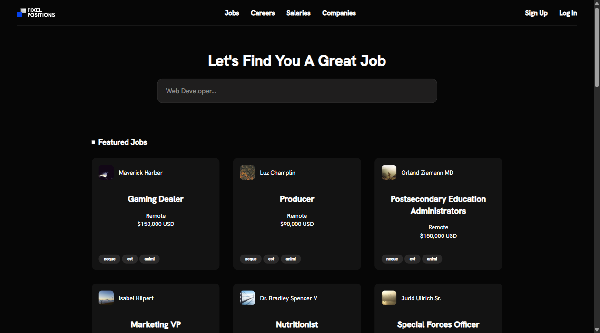

<p align="center"><a href="https://laravel.com" target="_blank"></a></p>

<p align="center">
<a href="https://github.com/laravel/framework/actions"></a>
<a href="https://packagist.org/packages/laravel/framework"></a>
</p>

# Job Board — Laravel 12 (Proof of Concept)

A small **job board** built with **Laravel 12.0**. Create, list, filter, and view job posts with basic auth and validation.

> Note: This is a **proof of concept** built after following the ["30 Days to Learn Laravel"](https://laracasts.com/series/30-days-to-learn-laravel-11) course on [Laracasts](https://laracasts.com/).

## Stack
- PHP 8.2+, **Laravel 12**, Blade
- Eloquent ORM, Migrations & Seeders
- Vite + Tailwind CSS
- DB: SQLite (default) or MySQL

## Features
- CRUD for jobs (title, company, location, description, tags)
- Search/filters & pagination
- Basic authentication/authorization
- Server-side validation
- Seeders for demo data *(optional)*

## Quick Start

```bash
# 1. Clone
git clone <your-repo-url>
cd <project-folder>

# 2. PHP deps
composer install

# 3. Env & app key
cp .env.example .env
php artisan key:generate

# 4. Database
#   Option A: SQLite
touch database/database.sqlite
#   In .env:
DB_CONNECTION=sqlite # (comment out other DB_*)

#   Option B: MySQL
#   In .env:
DB_CONNECTION=mysql # (and set others DB_* parameters)

# 5. URL & assets (important)
# In .env:
APP_URL=http://localhost:8000
ASSET_URL="${APP_URL}/storage"

php artisan storage:link

# 6. Migrations (+ optional seed)
php artisan migrate --seed

# 7. Frontend
npm install
npm run dev # or: npm run build
```

## Demo
- Email: `test@example.com`
- Password: `password`

## Useful scripts
- `php artisan serve` — local dev server
- `php artisan test` — run tests

## Structure (brief)
- `app/Models` — Eloquent models (e.g. `Job`)
- `app/Http/Controllers` — resource controllers
- `resources/views` — Blade templates
- `routes/web.php` — web routes

## Screenshots


## License
Personal/portfolio use. Dependencies retain their own licenses.


---

# Job Board — Laravel 12 (Proof of Concept) 🇮🇹


Piccola **bacheca di offerte di lavoro** sviluppata con **Laravel 12.0**. Consente di creare, elencare, filtrare e visualizzare annunci, con autenticazione e validazione di base.

> Nota: progetto realizzato come **proof of concept** dopo aver seguito il corso ["30 Days to Learn Laravel"](https://laracasts.com/series/30-days-to-learn-laravel-11) su [Laracasts](https://laracasts.com/).

## Stack
- PHP 8.2+, **Laravel 12**, Blade
- Eloquent ORM, migrazioni e seeders
- Vite + Tailwind CSS
- DB: SQLite (default) o MySQL

## Funzionalità
- CRUD annunci (titolo, azienda, sede, descrizione, tag)
- Ricerca/filtri e paginazione
- Autenticazione/autorizzazione di base
- Validazione lato server
- Seeders per dati demo *(opzionale)*

## Setup rapido

```bash
# 1. Clona
git clone <url-del-tuo-repo>
cd <cartella-progetto>

# 2. Dipendenze PHP
composer install

# 3. Env & chiave app
cp .env.example .env
php artisan key:generate

# 4. Database
#   Opzione A: SQLite
touch database/database.sqlite
#   In .env:
DB_CONNECTION=sqlite # (commenta le altre DB_*)

#   Opzione B: MySQL
#   In .env:
DB_CONNECTION=mysql # (oltre alle altre variabili DB_*)

# 5. URL & asset (importante)
# In .env:
APP_URL=http://localhost:8000
ASSET_URL="${APP_URL}/storage"

php artisan storage:link

# 6. Migrazioni (+ seed opzionale)
php artisan migrate --seed

# 7. Front-end
npm install
npm run dev # oppure: npm run build
```

## Demo
- Email: `test@example.com`
- Password: `password`

## Script utili
- `php artisan serve` — avvia server locale
- `php artisan test` — esegue i test (se presenti)

## Struttura (in breve)
- `app/Models` — modelli Eloquent (es. `Job`)
- `app/Http/Controllers` — controller REST
- `resources/views` — template Blade
- `routes/web.php` — rotte web

## Screenshot


## Licenza
Uso personale/portfolio. Le dipendenze mantengono le proprie licenze.
